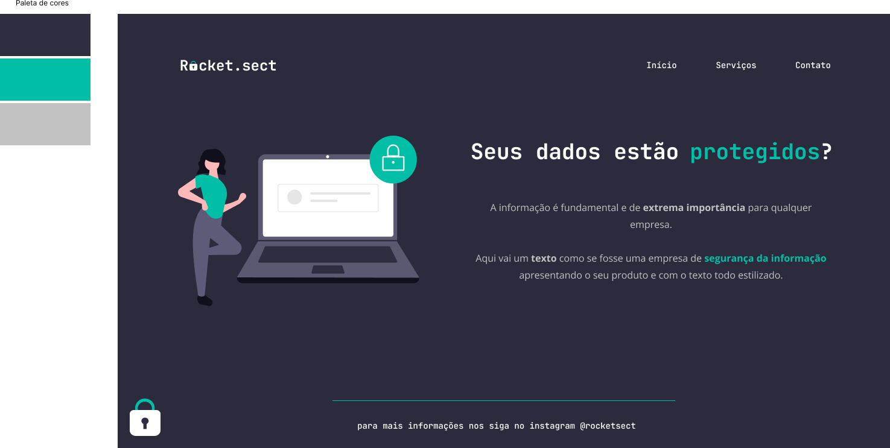

  

## 🚀 Tecnologias

Esse projeto foi desenvolvido com as seguintes tecnologias:

- [HTML](https://developer.mozilla.org/pt-BR/docs/Web/HTML)
- [CSS](https://developer.mozilla.org/pt-BR/docs/Web/CSS)

## 💻 Projeto

O projeto Rocket.sect é uma empresa de segurança da informação, ele foi elaborado na aula do programa Explorer da Rocketseat.

- [Página](https://igorsilvamedeiros.github.io/Explorer-desafio/)

## 🔖 Layout

No link abaixo você encontra o layout do projeto web. Lembrando que você precisa ter uma conta no [Figma](http://figma.com/) para acessá-lo.

- [Layout Web](<https://www.figma.com/file/euX4U7htMC0nwjszTuY3C7/Explorer-(Copy)?node-id=0%3A1>)
